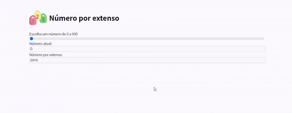

# Números por Extenso



### 1. Sobre 📙

Feito com puramente com `Javascript `, descreve os números por extenso em tela. 

### 2. Instalação Inicial 💻

```bash
npm i
```

### 3. Executar o projeto ▶️

```bash
npm run dev
```


***

[^Homework]: Realizado durante o curso Full Stack com a IGTI
[^When]: MAR/2020
[^Font:]: Icon made by Freepik from www.flaticon.com

